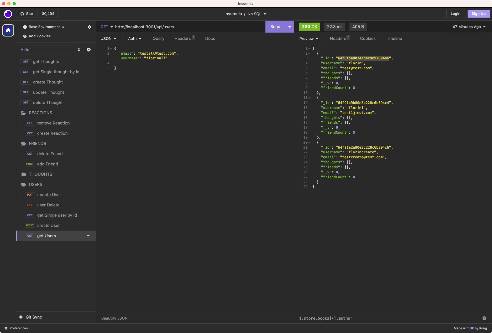

# Social_Network_API_NoSQL

## Description
It's an API for a social network web application where users can share their thoughts, react to friends’ thoughts, and create a friend list.

## Table of Contents

*[Installation](#Installation)
*[Usage](#Usage)
*[Credits](#Contribution)
*[License](#License)
*[Tests](#Tests)
*[Walkthrough Video](#Walkthrough-Videos)
*[Insomnia] (#Insomnia Screenshot)

## Installation

To run this project, install it locally using  npm install

## Usage

This application is use by the developers to share they thoughts about the technical aspects in codding.

## Credits

No
Made by Florin A

## License

## Walkthrough Video
[Click me to see the demo alkthrough Video](https://drive.google.com/file/d/1MGW94UyexW_MpqjxjAMs8vxyEE8L2MAL/view)

## Insomnia

## Badges
 
## Features

## How to Contribute

## Tests

npm run test

## Questions

For questions about this application you can send e-mail at goremic@yahoo.com 
or visti the GitHub repository code at: https://github.com/alexeflorin

